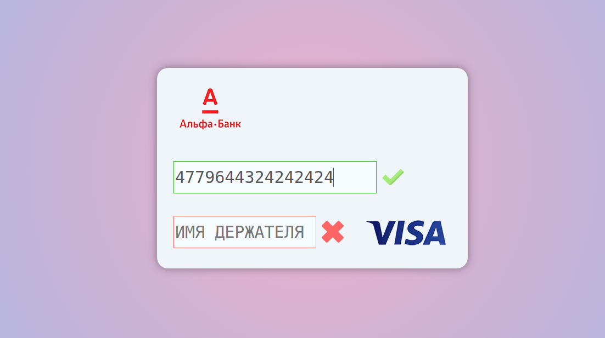

# Vue-interactive-bank-card
<h1>Проверка банковской карты на Vue.js 3</h1>

    Этот валидатор может определять 5 видов платежных систем 
    <ul>
        <li style=" display: flex;align-items: center;flex-direction: row;" >Visa  </li>
        <li style=" display: flex;align-items: center;flex-direction: row;" >Mir  </li>
        <li style=" display: flex;align-items: center;flex-direction: row;" >Mastercard  </li>
        <li style=" display: flex;align-items: center;flex-direction: row;" >Maestro  </li>
        <li style=" display: flex;align-items: center;flex-direction: row;" >American-express  </li>
    </ul>
    И 10 банков
    <ul>
        <li style=" display: flex;align-items: center;flex-direction: row;" >Альфа банк  </li>
        <li style=" display: flex;align-items: center;flex-direction: row;" >Газпром банк  </li>
        <li style=" display: flex;align-items: center;flex-direction: row;" >Мтс банк  </li>
        <li style=" display: flex;align-items: center;flex-direction: row;" >Банк Открытие  </li>
        <li style=" display: flex;align-items: center;flex-direction: row;" >Райфайзен банк  </li>
        <li style=" display: flex;align-items: center;flex-direction: row;" >Росбанк банк  </li>
        <li style=" display: flex;align-items: center;flex-direction: row;" >Банк Русский стандарт </li>
        <li style=" display: flex;align-items: center;flex-direction: row;" >Сбербанк </li>
        <li style=" display: flex;align-items: center;flex-direction: row;" >Втб банк  </li>
        <li style=" display: flex;align-items: center;flex-direction: row;" >Тинькофф банк  </li>
    </ul>
    <h2>Алгоритм Луна</h2>
    

        Алгоритм позволяет добится максимальной валидации карты.
    

    <ul>
        <li>Цифры проверяемой последовательности нумеруются справа налево.</li>
        <li>Цифры, оказавшиеся на нечётных местах, остаются без изменений.</li>
        <li>Цифры, стоящие на чётных местах, умножаются на 2.</li>
        <li>Если в результате такого умножения возникает число больше 9, оно заменяется суммой цифр получившегося произведения — однозначным числом, то есть цифрой.</li>
        <li>Все полученные в результате преобразования цифры складываются. Если сумма кратна 10, то исходные данные верны.</li>
    </ul>
    

